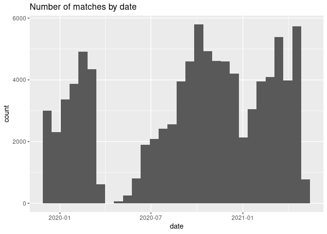

## Loading the data

We just read the train.csv file. This contains a lot of data. We also
make some variables to describe the columns of the data set.

``` r
matches <- read.csv("base_train.csv")
columns <- colnames(matches)
columns_for_game <- columns[grepl("[0-9]", columns) == FALSE]
columns_for_prev_game <- columns[grepl("[0-9]", columns) == TRUE]
unique_cols_for_prev <- unique(gsub("_[0-9]+", "", columns_for_prev_game))
```

## Definitions of Columns

### Per game

For each game, there is some data about the game itself.

``` r
library(tidyverse)
```

    ## ── Attaching packages ─────────────────────────────────────── tidyverse 1.3.1 ──

    ## ✓ ggplot2 3.3.5     ✓ purrr   0.3.4
    ## ✓ tibble  3.1.6     ✓ dplyr   1.0.8
    ## ✓ tidyr   1.2.0     ✓ stringr 1.4.0
    ## ✓ readr   2.1.2     ✓ forcats 0.5.1

    ## ── Conflicts ────────────────────────────────────────── tidyverse_conflicts() ──
    ## x dplyr::filter() masks stats::filter()
    ## x dplyr::lag()    masks stats::lag()

``` r
columns_for_game
```

    ##  [1] "X"                  "id"                 "target"            
    ##  [4] "home_team_name"     "away_team_name"     "match_date"        
    ##  [7] "league_name"        "league_id"          "is_cup"            
    ## [10] "home_team_coach_id" "away_team_coach_id"

#### id

Just a unique id for the game

``` r
head(matches["id"])
```

    ##         id
    ## 1 11906497
    ## 2 11983301
    ## 3 11974170
    ## 4 11974169
    ## 5 11982841
    ## 6 11974171

#### target

The variable you have to predict the probabilities only available in the
train set.

``` r
head(matches["target"])
```

    ##   target
    ## 1   away
    ## 2   draw
    ## 3   home
    ## 4   away
    ## 5   home
    ## 6   home

#### home_team_name

Just a unique id for the game

``` r
head(matches["home_team_name"])
```

    ##       home_team_name
    ## 1  Newell's Old Boys
    ## 2              UPNFM
    ## 3    Team Wellington
    ## 4 Hamilton Wanderers
    ## 5             Quiché
    ## 6      Auckland City

``` r
matches %>% count(home_team_name, sort=TRUE) %>% head()
```

    ##   home_team_name  n
    ## 1     Al Ittihad 71
    ## 2    River Plate 52
    ## 3       Juventus 47
    ## 4        Al Ahli 46
    ## 5        Arsenal 46
    ## 6         Gorica 44

#### away_team_name

The name of the Away the team. Hidden in test set, see this discussion

``` r
head(matches["away_team_name"])
```

    ##           away_team_name
    ## 1            River Plate
    ## 2               Marathón
    ## 3      Canterbury United
    ## 4 Wellington Phoenix Res
    ## 5              Marquense
    ## 6          Tasman United

``` r
matches %>% count(away_team_name, sort=TRUE) %>% head()
```

    ##   away_team_name  n
    ## 1     Al Ittihad 60
    ## 2    River Plate 59
    ## 3      Liverpool 47
    ## 4        Rangers 45
    ## 5  Real Sociedad 44
    ## 6        Al Ahli 43

#### match_date

The match date (UTC).

``` r
head(matches["match_date"])
```

    ##            match_date
    ## 1 2019-12-01 00:45:00
    ## 2 2019-12-01 01:00:00
    ## 3 2019-12-01 01:00:00
    ## 4 2019-12-01 01:00:00
    ## 5 2019-12-01 02:00:00
    ## 6 2019-12-01 03:00:00

Use Lubridate to parse the dates from a string.

``` r
library(lubridate)
```

    ## 
    ## Attaching package: 'lubridate'

    ## The following objects are masked from 'package:base':
    ## 
    ##     date, intersect, setdiff, union

``` r
dates <- parse_date_time(matches$match_date, "ymdHMS")
sprintf("earliest date: %s", min(dates))
```

    ## [1] "earliest date: 2019-12-01 00:45:00"

``` r
sprintf("most recent date: %s", max(dates))
```

    ## [1] "most recent date: 2021-05-01"

    ## `stat_bin()` using `bins = 30`. Pick better value with `binwidth`.



#### league_name

The league name.

``` r
head(matches["league_name"])
```

    ##        league_name
    ## 1        Superliga
    ## 2    Liga Nacional
    ## 3      Premiership
    ## 4      Premiership
    ## 5 Primera Division
    ## 6      Premiership

``` r
matches %>% count(league_name, sort=TRUE) %>% head()
```

    ##        league_name    n
    ## 1   Premier League 4011
    ## 2  Club Friendlies 2703
    ## 3 Primera Division 1747
    ## 4     Super League 1118
    ## 5          3. Liga  950
    ## 6          Ligue 1  855

#### league_id

The league id. Note that league names can be identical for two different
id.

``` r
head(matches["league_id"])
```

    ##   league_id
    ## 1       636
    ## 2       734
    ## 3      1055
    ## 4      1055
    ## 5       708
    ## 6      1055

#### is_cup

If the value is 1 the match is played for a cup competition.

``` r
matches %>% count(is_cup, sort=TRUE)
```

    ##   is_cup     n
    ## 1  False 73628
    ## 2   True  6525
    ## 3            1

#### home_team_coach_id

The id of the Home team coach.

``` r
head(matches["home_team_coach_id"])
```

    ##   home_team_coach_id
    ## 1             468196
    ## 2            2510608
    ## 3           37347427
    ## 4            5683765
    ## 5           37252510
    ## 6            1552285

#### away_team_coach_id

The id of the Away team coach.

``` r
head(matches["away_team_coach_id"])
```

    ##   away_team_coach_id
    ## 1             468200
    ## 2             456313
    ## 3           37348899
    ## 4             517852
    ## 5           14676834
    ## 6           37346930

### History

For each game there is also data about the last 10 games for both the
home and away team. These are the same for both the home and away team,
so we’ll just look at them for the last game of the home team.

``` r
unique_cols_for_prev
```

    ##  [1] "X.1"                               "home_team_history_match_date"     
    ##  [3] "home_team_history_is_play_home"    "home_team_history_is_cup"         
    ##  [5] "home_team_history_goal"            "home_team_history_opponent_goal"  
    ##  [7] "home_team_history_rating"          "home_team_history_opponent_rating"
    ##  [9] "home_team_history_coach"           "home_team_history_league_id"      
    ## [11] "away_team_history_match_date"      "away_team_history_is_play_home"   
    ## [13] "away_team_history_is_cup"          "away_team_history_goal"           
    ## [15] "away_team_history_opponent_goal"   "away_team_history_rating"         
    ## [17] "away_team_history_opponent_rating" "away_team_history_coach"          
    ## [19] "away_team_history_league_id"

#### home_team_history_match_date_1

The date of the last match played by Home team.

``` r
head(matches["home_team_history_match_date_1"])
```

    ##   home_team_history_match_date_1
    ## 1            2019-11-26 00:10:00
    ## 2            2019-11-28 01:15:00
    ## 3            2019-11-24 01:00:00
    ## 4            2019-11-23 03:30:00
    ## 5            2019-11-24 02:00:00
    ## 6            2019-11-23 02:00:00

#### home_team_history_is_play_home_1

If 1, the Home team played home.

``` r
head(matches["home_team_history_is_play_home_1"])
```

    ##   home_team_history_is_play_home_1
    ## 1                                0
    ## 2                                0
    ## 3                                0
    ## 4                                0
    ## 5                                0
    ## 6                                0

#### home_team_history_is_cup_1

If 1, the match was a cup competition.

``` r
head(matches["home_team_history_is_cup_1"])
```

    ##   home_team_history_is_cup_1
    ## 1                          0
    ## 2                          0
    ## 3                          0
    ## 4                          0
    ## 5                          0
    ## 6                          0

#### home_team_history_goal_1

The number of goals scored by the Home team on its last match.

``` r
head(matches["home_team_history_goal_1"])
```

    ##   home_team_history_goal_1
    ## 1                        0
    ## 2                        3
    ## 3                        0
    ## 4                        0
    ## 5                        0
    ## 6                        3

#### home_team_history_opponent_goal_1

The number of goals conceded by the Home team on its last match.

``` r
head(matches["home_team_history_opponent_goal_1"])
```

    ##   home_team_history_opponent_goal_1
    ## 1                                 1
    ## 2                                 1
    ## 3                                 1
    ## 4                                 4
    ## 5                                 1
    ## 6                                 0

#### home_team_history_rating_1

The rating of the Home team on its last match (pre match rating).

``` r
head(matches["home_team_history_rating_1"])
```

    ##   home_team_history_rating_1
    ## 1                   3.856860
    ## 2                   5.736719
    ## 3                  11.160533
    ## 4                   7.919133
    ## 5                   4.448714
    ## 6                  13.014300

#### home_team_history_opponent_rating_1

The rating of the opponent team on Home team last match (pre match
rating).

``` r
head(matches["home_team_history_opponent_rating_1"])
```

    ##   home_team_history_opponent_rating_1
    ## 1                            5.199840
    ## 2                            6.825194
    ## 3                            3.613117
    ## 4                           11.938750
    ## 5                            8.771536
    ## 6                            3.311450

#### home_team_history_coach_1

The coach id of the Home team on its last match.

``` r
head(matches["home_team_history_coach_1"])
```

    ##   home_team_history_coach_1
    ## 1                    468196
    ## 2                   2510608
    ## 3                  37347427
    ## 4                   5683765
    ## 5                  37252510
    ## 6                   1552285

#### home_team_history_league_id_1

The league name id by the Home team on its last match.

``` r
head(matches["home_team_history_league_id_1"])
```

    ##   home_team_history_league_id_1
    ## 1                           636
    ## 2                           734
    ## 3                          1055
    ## 4                          1055
    ## 5                           708
    ## 6                          1055
